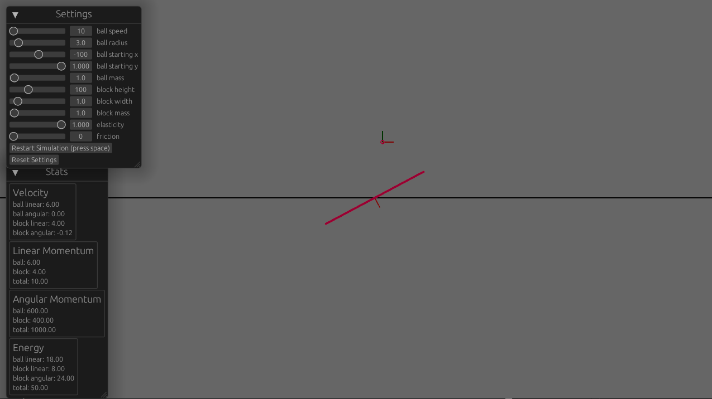

# Ball and Block Physics Simulation in Bevy/Rapier

This repo is a very simple physics simulation seeing what exactly happens when a moving
ball (or point) hits a block (or rod with no width). To play, visit https://lukemcneil.github.io/bevy_ball_and_block/. Here is a screenshot -

As the screenshot shows, there are many settings to play around with. Also, the velocity, linear momentum, angular momentum, and energy of the ball and block are shown before and after collision.

Partially inspired by this Bullet Block Experiment - https://www.youtube.com/watch?v=vWVZ6APXM4w.

# Controls

Change various parameters using the sliders on screen. Press space to restart the simulation.

# Running Locally

1. `git clone git@github.com:lukemcneil/bevy_ball_and_block.git`
2. `cd bevy_ball_and_block`
3. `cargo run`
